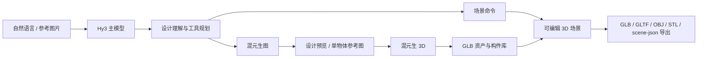
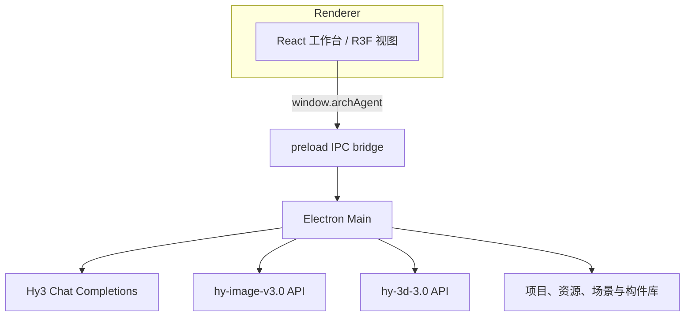

<div align="center">
  
  <h1>ArchAgent</h1>
  <p><strong>混元多模型驱动的对话式空间设计工作台</strong></p>
  <p>从自然语言或参考图片出发，完成设计决策、3D 资产生成、可编辑场景搭建与多格式导出。</p>
  <p>
    <a href="#混元多模型闭环">混元能力</a> ·
    <a href="#端到端演示脚本">演示脚本</a> ·
    <a href="#快速开始">快速开始</a> ·
    <a href="#安全设计">安全设计</a> ·
    <a href="#贡献">贡献</a>
  </p>
  <p>
    
    
    
    
    
  </p>
  <p>
    
    
    
    
    
    
    
    
  </p>
</div>

## 项目定位

ArchAgent 是一个基于 **Electron + React + React Three Fiber** 的桌面空间设计智能体，不是普通聊天应用。它把自然语言对话、参考图理解、场景命令、全局构件库和实时 3D 编辑器放进同一工作台，用于建筑、房间与室内方案的创建和迭代。

用户可以从一句设计需求或一张参考图片开始，逐步形成可编辑的建筑元素与资产实例，最后导出 `GLB`、`GLTF`、`OBJ`、`STL` 或可编辑 JSON（`scene-json`）。项目、会话、场景、资源和产物由本地应用管理。

## 为什么不是聊天应用

| 普通聊天 | ArchAgent 工作台 |
| --- | --- |
| 输出以文本为主 | 将文本决策转为受版本控制的场景命令与可编辑节点 |
| 图片只作为对话上下文 | 参考图片可用于物体提取、设计预览和单件 3D 资产生成 |
| 结果难以继续编辑 | R3F 视图支持场景选择、画墙、属性编辑、拖拽、撤销重做与导出 |
| 一次性回答 | 项目、会话、资源、构件库与导出产物可在桌面工作台中继续使用 |

## 混元多模型闭环

ArchAgent 通过 API 组合 Hy3、混元生图和混元生 3D，形成以下工作流：



### Hy3 在系统中承担的角色

| 能力 | 实际模型与接口 | 在 ArchAgent 中的职责 |
| --- | --- | --- |
| 对话与规划 | `HY3_CHAT_MODEL`（默认 `hy3`），OpenAI-compatible Chat Completions | 多轮设计理解、图片输入理解、工具选择、重建计划和场景命令生成 |
| 设计预览与参考处理 | `hy-image-v3.0` | 生成二维设计预览；从复杂参考图中提取干净的单件物体参考图 |
| 3D 资产生成 | `hy-3d-3.0` | 将中文文本描述或单件参考图片生成 GLB 资产，登记到构件库后再摆放到场景 |

三类能力共同构成“**文本/参考图 → 设计决策 → 3D 资产 → 可编辑场景 → 导出**”的闭环。所有混元能力均通过远程 API 调用完成；项目**不进行模型训练、微调或本地推理部署**。

## 核心能力

- **对话式空间设计**：Agent 基于当前项目、会话资源和场景快照创建、更新或删除建筑元素，并返回可追踪的工具结果。
- **可编辑 3D 场景**：支持场地、建筑、楼层、墙、门、窗、楼板、天花、柱、房间分区、楼梯、围栏和导入资产；提供选择、画墙、属性检查、拖拽移动、撤销重做及多视角浏览。
- **本机构件库**：模型可按名称、类别、标签和描述检索、预览和编辑元数据，并可实例化到不同项目的场景中。
- **资源与文件工作区**：支持导入文件和剪贴板附件，浏览项目目录，创建、重命名、编辑、删除和打开工作区文件；常见文档、图像和 3D 文件支持预览。
- **重建确认流程**：复杂图片先拆成单件资源与待确认计划；计划中记录假设、必答项、待复用或待生成资产，确认后才开始生成与摆放。
- **场景核验与导出**：可读取场景快照、预览资产落点和几何关系，并获取不同视角的 WebGL 场景预览；支持 `scene-json`、`GLB`、`GLTF`、`OBJ`、`STL` 导出。

## 端到端演示脚本

以下脚本用于演示已实现的工作流；实际生成结果取决于输入内容、服务配置和 API 返回。

### Demo 1：自然语言创建并迭代房间

1. 新建或打开一个项目，在对话面板输入：

```text
创建一个 5m × 4m 的卧室：南墙放一扇门和一扇窗，北墙摆放一张双人床和两个床头柜。
```

2. Agent 读取当前场景后，创建墙、门、窗和其他必要建筑元素；可复用构件会优先从构件库检索。
3. 在 3D 工作台检查结果。继续输入例如“把床移动到北墙中央，床头朝向北方”，由 Agent 更新摆放；也可直接在工作台选中和调整节点。
4. 通过工作台导出按钮选择 `GLB`、`STL`、`OBJ` 或 `scene-json`。

### Demo 2：参考图到可编辑 3D 资产并导出

1. 将一张包含目标家具的参考图作为附件导入项目。
2. 在对话中要求提取目标单件物体。混元生图会生成干净的单物体参考图，供用户确认。
3. 确认后创建重建计划并生成该物体的 GLB。混元生 3D 只处理可独立摆放的单件资产，不将整间房或混合场景直接生成为一个模型。
4. 将生成资产登记到构件库并实例化到当前场景，使用场景预览检查摆放后，导出 `GLB`、`STL`、`OBJ` 或 `scene-json`。

## 演示视频 / GIF


https://github.com/user-attachments/assets/70d12865-68c8-47de-a149-1023449379df


## 快速开始

### 环境要求

- Node.js 与 npm
- Windows 桌面环境用于完整 Electron 打包与运行验证

### 安装与运行

在 Windows PowerShell 中执行：

```powershell
npm install
Copy-Item .env.example .env.local
npm run dev
```

应用以 Electron 运行。不要直接在浏览器中打开 Renderer 页面，否则无法使用 preload IPC、项目文件、会话资源和场景能力。

## 配置

`.env.local` 优先于 `.env` 加载；也可以在应用内“运行设置”保存配置。复制 [`.env.example`](.env.example) 后，至少填写以下真实配置：

```dotenv
HY3_API_KEY=
HY3_BASE_URL=https://tokenhub.tencentmaas.com/v1
HY3_CHAT_MODEL=hy3
```

完整示例包含图像、3D、超时和高级执行配置。常用字段如下：

- Hy3 主模型：`HY3_API_KEY`、`HY3_BASE_URL`、`HY3_CHAT_MODEL`、`HY3_THINKING_ENABLED`、`HY3_REASONING_EFFORT`。
- 混元生图：`HY3_IMAGE_ENDPOINT`、`HY3_IMAGE_MODEL=hy-image-v3.0`、`HY3_IMAGE_REQUEST_TIMEOUT_S`。
- 混元生 3D：`HY3_3D_SUBMIT_ENDPOINT`、`HY3_3D_QUERY_ENDPOINT`、`HY3_3D_MODEL=hy-3d-3.0`、`HY3_3D_FACE_COUNT`、轮询和超时配置。
- 高级执行：`AGENT_EXEC_BASH_ENABLED=false`、`AGENT_SCRIPT_TIMEOUT_S`。仅在可信任务中开启。

`HY3_*` 是推荐配置名；程序对部分 `OPENAI_*` 历史变量保留兼容读取。不要提交包含真实密钥的 `.env.local`。

## 安全设计

- **密钥隔离**：`HY3_API_KEY` 仅由 Electron Main 进程加载和使用，Renderer 不直接读取密钥。
- **受限桥接**：Renderer 只通过 preload 暴露的 `window.archAgent` 调用明确列出的 IPC 能力，不启用 Node 集成。
- **受限文件访问**：项目、应用数据和用户授权附件由 Main 进程的文件与资源服务管理，Agent 工具不接收任意本机路径。
- **受控执行**：`exec_bash` 默认关闭；开启后仍要求明确用途和预期产物。

## 架构



场景模型由 `src/shared/modeling3d` 的自定义契约和 reducer 定义。Main 进程执行场景命令、维护撤销重做并管理项目持久化；Renderer 使用 Three.js、React Three Fiber、React Three Drei 和自研场景图层渲染建筑元素与导入资产。

## 技术栈

- 桌面与构建：Electron、electron-vite、electron-builder
- 前端：React 19、TypeScript、Redux Toolkit、React Redux
- 3D：Three.js、React Three Fiber、React Three Drei
- 场景与几何：自研场景契约/reducer、JSCAD、replicad
- Agent 与模型：`@earendil-works/pi-coding-agent`、`@earendil-works/pi-ai`、OpenAI-compatible API、Tencent Hunyuan Hy3
- UI 与文件：Radix UI、lucide-react、Monaco Editor、Incremark、Mermaid、Mammoth、pdf-parse、Sharp
- 测试：Vitest

## 可用脚本

```bash
npm run dev           # 开发模式启动 Electron + Vite
npm run build         # 类型检查并构建 Main / Preload / Renderer
npm run pack          # 构建并生成 win-unpacked 目录
npm run dist          # 构建 NSIS 与 ZIP 安装产物
npm run preview       # 预览构建产物
npm test              # 运行全部 Vitest 测试
npm run test:watch    # 监听模式运行测试
npm run typecheck     # TypeScript 类型检查
npm run icon:generate # 生成应用图标
```

## 验证

建议在提交前运行：

```bash
npm run typecheck
npm test
git diff --check
```

本 README 未声明任何 API 调用、模型生成或端到端测试已经完成；演示需要在已配置有效密钥的本地环境中执行。

## 贡献

贡献流程、代码约定、验证和提交规则见 [CONTRIBUTING.md](CONTRIBUTING.md)。PR 请使用 [PR 模板](.github/PULL_REQUEST_TEMPLATE.md)。

## 许可证

本项目采用 [GNU Affero General Public License v3.0 only](LICENSE)（`AGPL-3.0-only`）许可。

## 文档

- [设计文档索引](docs/design/README.md)
- [技术方案](docs/design/ArchAgent-技术方案.md)
- [编辑器设计方案](docs/design/ArchAgent-编辑器设计方案.md)
- [接口文档](docs/design/ArchAgent-接口文档.md)
- [UI 设计文档](docs/design/ArchAgent-UI设计文档.md)
