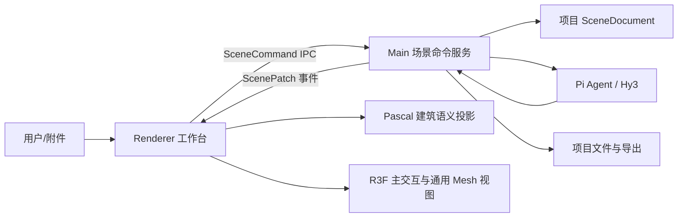

# ArchAgent 技术方案

## 1. 定位与范围

ArchAgent 是本地优先的 3D 智能建模工作台。首期让用户通过自然语言、结构化数据或户型图创建并持续编辑建筑/室内场景；用户也可以导入 GLB/OBJ 资产作为家具、装饰或参考模型。

首期不包含 IFC 工作流、顶点/边/面级 Mesh 编辑、UV 制作、骨骼绑定或贴图烘焙。复杂构件通过 JSCAD 或 Replicad 参数化重生成，导入 Mesh 采用整体替换而非拓扑编辑。

## 2. 技术选型

| 层级 | 技术 | 职责 |
| --- | --- | --- |
| 桌面壳 | Electron + electron-vite | 本地文件、窗口、IPC 和安全边界 |
| 前端 | React 19 + TypeScript | 编辑器工作台与对话界面 |
| 建筑语义适配 | `@pascal-app/core` + `@pascal-app/viewer` | 建筑节点投影、几何系统和可选 WebGPU 建筑视图 |
| 编辑器交互壳 | Three.js + React Three Fiber + Drei | 主相机控制、选择、gizmo、通用资产和渲染扩展 |
| 参数化构件 | JSCAD，后续可接 Replicad | 由 Agent 生成可复现的复杂构件 |
| Agent | Pi Agent + Hy3 OpenAI-compatible API | 规划、工具调用、结果解释 |

Pascal 的 `core/viewer` 是建筑语义适配器，不是整个应用的数据边界或完整编辑器。上游完整 `@pascal-app/editor` 可用于参考工具、相机和选择交互；它依赖 Next.js 与上游未发布节点包，因此不直接嵌入 Electron/Vite 壳。R3F 是本项目的主交互视图，Pascal 只消费 Main 场景快照中可映射的建筑节点。

`TangSY/aedifex` 同样仅作为 MIT 上游代码参考。它验证了建筑优先编辑器的能力拆分，但其完整应用、Zustand/Zundo 状态和 IndexedDB 持久化不能接入本项目。ArchAgent 只按能力逐项自研或重写，并保持 Main 进程的场景权威性。

## 3. 总体架构



### 3.1 单一事实来源

`SceneDocument` 是项目的持久化事实来源，包含版本号、Pascal 建筑节点、Mesh 资产清单和项目元数据。Main 进程的 `SceneCommandService` 是唯一允许提交增删改、撤销重做和导出的入口。

Renderer 中的 Pascal `useScene` 仅是渲染投影：收到快照或 patch 后更新并标记 dirty nodes，不能成为 Main 与 Agent 之间共享的跨进程 store。

### 3.2 Agent 安全流程

```text
自然语言 / 图像 / 外部数据
  → Agent 规划
  → ScenePatch dry-run + Zod 校验 + revision 校验
  → Ghost 预览
  → 用户确认或自动提交（按权限）
  → CommandService 写入历史并广播 patch
```

Agent 与人工工具必须调用同一套命令，不能直接修改 Three.js Object3D 或 renderer store。

## 4. 场景与资产模型

```text
ProjectScene
├── ArchitectureDomain（Pascal）
│   └── Site → Building → Level → Wall / Door / Window / Slab / Zone / Item
└── AssetDomain
    └── MeshAsset → GLB/OBJ、变换、材质覆盖、来源、挂载位置
```

首期的 `MeshAsset` 由 R3F 作为主视图显示和交互；在语义可表达时可额外映射为 Pascal `ItemNode`。这样静态家具、装饰和参考模型不会受 Pascal 节点能力限制。以后需要骨骼动画、表情或行业专用节点时，再为资产增加专用适配器，不改变建筑场景契约。

## 5. 图像与外部数据

| 输入 | 首期处理方式 | 输出 |
| --- | --- | --- |
| 文本、JSON、CSV | Agent 解析约束并生成 ScenePatch | 可编辑 Pascal 节点 |
| 户型图、草图 | 视觉模型提取墙线、尺寸、门窗 | 待确认的建筑 ghost 节点 |
| 房间照片 | 提取近似布局与参考尺寸 | 场景建议，不承诺高精 Mesh |
| GLB/OBJ | 复制到项目 `assets/` 并登记 | 可摆放 MeshAsset |

图片到结构化布局与图片到通用 Mesh 是两条不同链路。首期优先前者；后者只接收外部生成结果，不承诺在应用内修网格。

## 6. 导出与持久化

项目目录包含 `scene.json`、`assets/`、`input/` 与 `output/`。JSON 场景导出是首期保证能力；GLB/STL/OBJ 导出由独立导出适配器逐步实现，不能依赖上游 Pascal MCP 的未实现 GLB 导出。

## 7. 实施阶段

1. **基础层**：`SceneDocument`、命令服务、版本校验、IPC、持久化和 Renderer 场景同步。
2. **P0 编辑器**：墙体命令、场景树、属性面板与 Pascal 建筑投影。
3. **P1 空间编辑**：自研 R3F 相机、选择和高亮；随后接入 gizmo、Wall/Door/Window/Slab、撤销重做、项目持久化与户型图输入。
4. **P2 Agent 与资产**：结构化场景命令、ghost preview、GLB/OBJ 导入、材质覆盖、JSCAD 构件重生成。
5. **后续插件域**：角色动画、IFC、通用 Mesh 编辑或其他行业模型各自通过适配器扩展。
