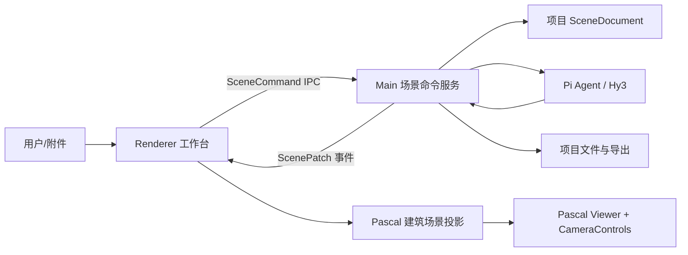

# ArchAgent 技术方案

## 1. 定位与范围

ArchAgent 是本地优先的建筑与空间 3D 智能建模工作台。首期让用户通过自然语言、结构化数据或户型图创建并持续编辑建筑/室内场景。

产品范围聚焦建筑：Site、Building、Level、Wall、Slab，以及后续的 Door、Window、Zone、Ceiling、Roof 和建筑语义可表达的 Item。首期不承诺通用 GLB/OBJ 导入、人物、扫描模型、顶点/边/面级 Mesh 编辑、UV、骨骼绑定、动画、贴图烘焙或 IFC 工作流；这些能力若未来需要，必须作为独立领域评估，不能影响当前建筑场景契约。

## 2. 技术选型

| 层级 | 技术 | 职责 |
| --- | --- | --- |
| 桌面壳 | Electron + electron-vite | 本地文件、窗口、IPC 和安全边界 |
| 前端 | React 19 + TypeScript | 编辑器工作台、属性面板和对话界面 |
| 建筑编辑视图 | `@pascal-app/core` + `@pascal-app/viewer` | 唯一建筑语义视图、WebGPU 场景、建筑节点与几何能力 |
| 相机交互 | Drei `CameraControls` | 嵌入 Pascal Viewer 的轨道、平移、缩放和视图预设 |
| 参数化构件 | JSCAD，后续可接 Replicad | 由 Agent 生成可复现的建筑参数构件 |
| Agent | Pi Agent + Hy3 OpenAI-compatible API | 规划、工具调用、结果解释 |

Pascal 是产品唯一常驻的建筑编辑渲染上下文。其 `core/viewer` 提供建筑层级、场景、选择、楼层、几何、空间/BVH 和后处理等能力；自研层负责工作台 UI、命令、历史、持久化和 Agent 边界。上游完整 `@pascal-app/editor` 依赖 Next.js 与未发布节点包，不能直接嵌入 Electron/Vite。

不提供 R3F/WebGL 运行时回退。回退会维护两套几何、选择和相机投影，并限制 Pascal 内置能力的使用。R3F 实验实现仅保留在 `legacy/r3f-editor` 历史分支，作为未来参考，不进入 `main` 产品路径。

`TangSY/aedifex` 仅作为 MIT 上游实现参考。它验证了建筑优先编辑器的能力拆分，但其完整应用、Zustand/Zundo 状态和 IndexedDB 持久化不能接入本项目。

## 3. 总体架构



### 3.1 单一事实来源

`SceneDocument` 是项目的持久化事实来源，包含版本号、建筑节点、材质规格和项目元数据。Main 进程的 `SceneCommandService` 是唯一允许提交增删改、撤销重做和导出的入口。

Renderer 中 Pascal 的 `useScene` 是运行时渲染镜像：收到快照或 patch 后同步并标记 dirty nodes，但不能成为 Main 与 Agent 之间共享的跨进程 store。UI 和 Agent 都只能提交 `SceneCommand`，不能直接写 Pascal store。

### 3.2 Agent 安全流程

```text
自然语言 / 图像 / 外部数据
  → Agent 规划
  → ScenePatch dry-run + Zod 校验 + revision 校验
  → Ghost 预览
  → 用户确认或自动提交（按权限）
  → CommandService 写入历史并广播 patch
  → Pascal 场景同步最新快照
```

## 4. 场景模型

```text
ProjectScene
└── ArchitectureDomain（Pascal）
    └── Site → Building → Level → Wall / Door / Window / Slab / Zone / Ceiling / Roof / Item
```

建筑节点使用米作为坐标单位，地面为 X/Z 平面，Y 为高度。材质从 `materialPreset` 逐步扩展为颜色、粗糙度、金属度、不透明度和 Pascal 可表达的纹理引用；不把通用 PBR 或网格编辑能力作为首期契约。

## 5. 图像与外部数据

| 输入 | 首期处理方式 | 输出 |
| --- | --- | --- |
| 文本、JSON、CSV | Agent 解析约束并生成 ScenePatch | 可编辑建筑节点 |
| 户型图、草图 | 视觉模型提取墙线、尺寸、门窗 | 待确认的建筑 ghost 节点 |
| 房间照片 | 提取近似布局与参考尺寸 | 场景建议，不承诺高精模型 |

首期优先将外部信息还原为可校验的建筑结构，而非在应用内生成或修复通用三角网格。

## 6. 导出与持久化

项目目录包含 `scene.json`、`input/` 与 `output/`。JSON 场景持久化和导出是首期保证能力；其他格式的导入导出在有明确建筑语义和独立适配器后再接入，不依赖上游未实现的 Pascal MCP 导出能力。

## 7. 实施阶段

1. **基础层**：`SceneDocument`、命令服务、版本校验、IPC、持久化和 Renderer 场景同步。
2. **P0 编辑器**：Pascal Viewer、相机控制、墙体命令、场景树、属性面板与建筑投影。
3. **P1 空间编辑**：选择、高亮、画墙预览、楼板、门窗、撤销重做、项目持久化与户型图输入。
4. **P2 Agent 建模**：结构化场景命令、ghost preview、材质规格与参数化构件重生成。
5. **后续建筑能力**：空间检测、屋顶/天花、构件库和建筑格式互操作，均通过建筑命令主链路接入。
