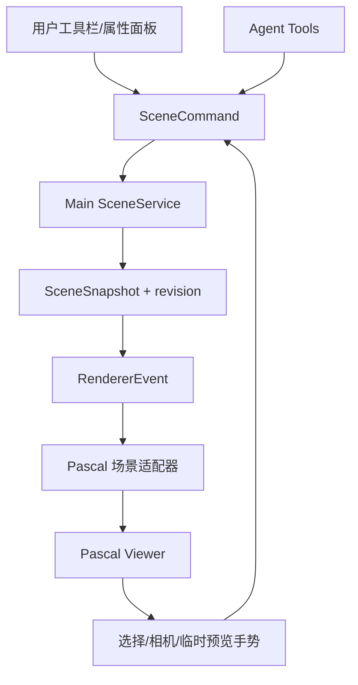

# ArchAgent 编辑器设计方案

## 1. 定位与首期范围

ArchAgent 是 Agent 驱动的建筑与空间 3D 建模工作台。首期解决从自然语言、结构化数据、户型图和参考图片创建并修改房间、楼层与建筑构件的问题。

首期重点：

1. 建筑层级：Site、Building、Level。
2. 空间构件：Wall、Slab、Ceiling、Column、Zone、Stair、Fence、Door、Window；Roof 是下一阶段的组合屋面能力。
3. 用户与 Agent 使用同一套可验证的场景命令。
4. 建筑参数、材质预设、尺寸与空间关系的可视化和编辑。
5. 以 Pascal 建筑节点为边界构建构件库。

首期支持 `scene.json` 可编辑场景的导入导出，以及 GLB、GLTF、OBJ、STL 的网格交换。外部网格以参考资产形式导入，不自动转换成可编辑的墙、门、窗；人物、顶点/边/面级 Mesh 编辑、UV、贴图烘焙、骨骼绑定、动画、IFC 工作流或 Blender 级通用建模仍是独立能力域，不能反向决定当前建筑建模架构。

## 2. 核心决策

### 2.1 单一场景事实来源

Main 进程中的 `SceneService` 保存唯一权威 `SceneSnapshot`。Renderer、Pascal 和 Agent 都不得直接持有可提交的第二份场景状态。

所有变更必须是 `SceneCommand`：

```text
用户操作 / Agent 工具
  -> SceneCommand
  -> Main SceneService 校验与应用
  -> 新 SceneSnapshot + revision + RendererEvent
  -> Pascal Viewer 同步最新快照
```

命令失败时必须返回可读原因，不能改动 snapshot，也不能广播事件。revision、历史、项目持久化和导出均以这一链路为边界。

### 2.2 Pascal 是唯一建筑编辑视图

`@pascal-app/core` 与 `@pascal-app/viewer` 是唯一的建筑语义与渲染视图，负责：

- Site、Building、Level、Wall、Slab、Door、Window 等建筑节点及其几何。
- 常驻 WebGPU 场景、选择、楼层可见性、空间/BVH 和后处理能力。
- 可映射的建筑材质和选择反馈。

Drei `CameraControls` 仅嵌入 Pascal Viewer，提供轨道、平移、缩放、聚焦和视图预设。自研编辑器层负责把工具栏、属性面板和视图手势转换为 `SceneCommand`，不直接修改场景数据。

Pascal 不是 `SceneService` 的替代品：它不承担统一 undo/redo、项目持久化或 Agent 工具入口；其 store 只是 Renderer runtime mirror。也不引入 R3F/WebGL 作为兼容回退，以免维护第二套几何和交互投影。R3F 仅保留在 `legacy/r3f-editor` 历史分支。

### 2.3 上游参考与自研边界

`TangSY/aedifex` 是建筑编辑交互的实现参考，不是 ArchAgent 的运行时依赖。其墙体绘制、端点移动、选择、吸附和 MCP 工具组织可用于校验实现方向；但它是带有 Zustand/Zundo/IndexedDB 状态的 Next.js 完整应用，不能嵌入 Electron/Vite 或成为第二个场景事实来源。

建筑工具先维护临时预览，再在指针释放或用户确认时提交 `SceneCommand`。不得复制 Aedifex 的 store、路由、持久化或完整 UI；每个借鉴能力都必须连接到 `SceneCommand -> SceneService -> SceneSnapshot` 链路。

## 3. 总体架构



### 3.1 视图适配器契约

Pascal 视图只消费场景快照，并通过命令回传用户意图：

```ts
interface PascalViewportAdapter {
  render(snapshot: SceneSnapshot): void;
  focus(nodeIds: string[]): void;
  setSelection(nodeIds: string[]): void;
}
```

视图事件必须被转换为命令。例如，选中墙体后修改高度提交 `wall.update`。视图不能直接写 Pascal Zustand store 或项目文件。

### 3.2 Pascal 适配规则

统一场景契约是扁平图，使用 `parentId` 表达关系；Pascal Viewer 按 `children` 递归渲染。`PascalSceneAdapter` 必须在 Renderer 边界构建层级：

```text
SceneSnapshot.parentId
  -> Pascal children
  -> Site -> Building -> Level -> Wall / Slab / Door / Window
```

Pascal `useScene` 仅接受投影后的节点。更新 snapshot 时同步投影；不要把 Pascal 的本地 history、IndexedDB 持久化或本地编辑结果当作项目数据。

### 3.3 节点能力映射

| 场景能力 | Pascal 建筑视图 | ArchAgent 自研层 |
| --- | --- | --- |
| Site / Building / Level / Wall / Slab | 主语义、几何与渲染 | 命令、属性与历史 |
| Door / Window / Zone / Ceiling / Roof | 后续建筑节点适配 | 工具、校验与 Agent 参数 |
| 材质预设与可映射属性 | 场景预览 | 材质规格、命令与持久化 |
| 选择、楼层、空间关系 | 内置场景能力 | 面板同步、业务规则 |
| 顶点 / 边 / 面、UV、骨骼、人物 | 不在产品范围 | 不在产品范围 |

无法映射为 Pascal 建筑节点的网格可以作为受限的参考资产进入视图：其文件由 Main 进程复制到项目 `.agent/assets/`，其位置、旋转、缩放保存于 `SceneSnapshot`，但不参与建筑语义编辑或 Agent 的构件修改工具。

## 4. 场景与材质模型

```text
ProjectScene
└── ArchitectureDomain
    └── Site -> Building -> Level -> Wall / Slab / Ceiling / Column / Zone / Stair / Fence / Door / Window
```

建筑节点使用米作为坐标单位，地面为 X/Z 平面，Y 为高度。材质模型从 `materialPreset` 逐步扩展为颜色、粗糙度、金属度、不透明度和 Pascal 支持的纹理引用；资源路径必须是项目相对路径，不能在 IPC 命令中传播任意绝对路径。

## 5. 交互与工具

### 5.1 视图工具

| 工具 | 首期责任 |
| --- | --- |
| Select | 选择、取消选择、属性面板同步和高亮 |
| Orbit / Pan / Zoom | Pascal Viewer 内的 `CameraControls` 轨道、平移、缩放与聚焦 |
| Focus / Isolate | 根据选中节点或楼层调整视图；不修改场景 |
| View preset | 自由、顶视、正视、右视和重置相机 |

### 5.2 建筑创建工具

| 阶段 | 工具 | 说明 |
| --- | --- | --- |
| 已完成 P1 | 墙体表单与 WallTool、楼板、天花、柱、房间、直梯、围栏、门窗、场景树与属性 | 所有正式构件均有参数检查器、选择、删除、历史与 Pascal 投影；画墙预览按 0.25 米网格吸附，确认后才提交统一命令 |
| 后续 P1 | SlabTool、DoorTool、WindowTool、其他构件鼠标工具 | 鼠标预览、网格吸附、墙体端点连接和构件校验 |
| P2 | Roof、RoofSegment、Skylight、建筑 Item | 屋面需要作为组合节点图实现，不能以孤立卡片伪造为可用能力 |

拖拽预览和 Ghost preview 只保存临时 UI 状态。松开鼠标或确认预览后才提交命令；取消时不产生历史记录。

## 6. Agent 集成

Agent 工具是 `SceneCommand` 的受限领域入口，不直接调用 Pascal API：

```text
用户：“在一层北侧增加 3 米砖墙”
  -> Agent 读取场景摘要
  -> create_wall 参数校验
  -> Main SceneService 应用 wall.create
  -> 广播 snapshot
  -> Pascal Viewer 同步更新
```

图片、户型图或外部结构化数据先生成候选命令和置信度；高影响操作使用 Ghost preview 或确认步骤。Agent 输出应包含受影响节点、revision 和失败时的校验原因。

当前运行时工具集为 `get_scene`、`create/update_wall`、`create/update_slab`、`create/update_ceiling`、`create/update_column`、`create/update_zone`、`create/update_stair`、`create/update_fence`、`create/update_door`、`create/update_window`、`delete_node`。`get_scene` 返回只读的楼层及全部正式构件摘要，供 Agent 取得真实节点 ID；Agent 不能直接写 Pascal store，也不能声称创建当前未支持的屋顶、资产或导出格式。

## 7. 文件组织

```text
src/shared/modeling3d/
  sceneContracts.ts          # SceneSnapshot、节点、材质和命令契约
  sceneReducer.ts            # 纯校验与状态变更

src/main/modeling3d/
  sceneService.ts            # 唯一权威场景、IPC 事件和持久化入口

src/renderer/src/features/modeling3d/
  editor/                    # 工具栏、场景树、属性面板和临时编辑状态
  scene/                     # Pascal 场景层级和数据适配器
  viewer/                    # PascalViewer、相机控制和局部错误边界
```

共享领域、Main 服务、Renderer 交互和 Pascal 适配器必须保持独立目录，禁止把命令校验、React 状态和场景构建堆入同一文件。

## 8. 路线图与验收

1. **P0 场景命令**：默认建筑场景、Pascal Viewer、相机控制、墙体新增/修改/删除、IPC、Agent 工具、场景树与属性面板。
2. **P1 空间编辑**：画墙预览、Pascal 原生选择高亮、楼板、天花、柱、房间、直梯、围栏、门窗、撤销重做与项目持久化已完成；剩余各构件鼠标工具和户型图输入。
3. **P2 Agent 建模**：户型图/结构化数据生成、Ghost preview、材质规格和参数化构件重生成。
4. **后续建筑能力**：空间检测、屋顶/天花、构件库和建筑格式互操作。

首期验收标准：用户可通过表单、Pascal 视图工具或 Agent 创建并修改建筑空间；每次接受的操作都在 Pascal 场景中反映；WebGPU 初始化失败时显示局部错误与重试入口，不切换到 R3F/WebGL 编辑器。
