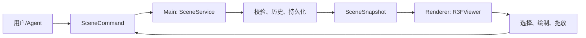

# ArchAgent 编辑器设计方案

## 1. 产品定位

ArchAgent 是面向建筑与室内空间的 Agent 辅助三维编辑器。用户、人工工具和 Agent 通过同一套场景命令创建、修改和布局建筑构件与外部三维资产。

首期聚焦建筑与空间，但场景契约保留 `asset` 节点，后续可扩展家具、软装和通用图生 3D 资产。

## 2. 当前技术基线

主线使用 Three.js + React Three Fiber（R3F）作为唯一编辑渲染路径：

- R3F `Canvas` 持有 WebGL 上下文、相机和渲染循环。
- Drei `CameraControls` 负责平移、缩放、聚焦及预设视角。
- 自研 R3F HUD 导航球负责旋转，不创建第二个 WebGL 上下文。
- `SceneService` 保存唯一权威 `SceneSnapshot`；Renderer 只渲染快照并提交命令。
- Agent、表单、绘墙、拖放、导入导出都经过共享 `SceneCommand` 边界。

不再依赖 Pascal、WebGPU 或 Pascal 的运行时 store。`legacy/r3f-editor` 仅是历史参考分支，不能覆盖或替代 `main` 的业务能力。

## 3. 分层与数据流



### 3.1 场景契约

`SceneSnapshot` 是项目 `.agent/scene.json` 的可编辑、可往返表示。建筑节点使用米作为单位，X/Z 是地面平面，Y 是高度。

现有节点包括：`wall`、`slab`、`ceiling`、`column`、`zone`、`stair`、`fence`、`door`、`window` 与 `asset`。建筑结构仍以参数化节点保存；外部 GLB、GLTF、OBJ、STL 作为位置、旋转、缩放可编辑的 `asset` 保存。

### 3.2 R3F 渲染边界

`R3FViewer` 只接收快照和回调，组合以下职责：

- `ArchitectureSceneLayer`：将语义建筑节点投影为 Three 几何；墙体按门窗开口切分，避免只贴门窗贴图。
- `ImportedAssetLayer`：加载项目受控目录内的外部网格，并用包围框反馈选中状态。
- `R3FCameraControls` 与 `NavigationGizmo`：持有纯视图状态，不写入项目数据。
- `WallDrawingOverlay`、`SelectedNodeDragController`：把手势转换为命令预览和最终提交。
- `SceneExportBridge`：导出可见 authored geometry，排除网格、导航和选中辅助物。

渲染层不得直接写 `SceneSnapshot`、项目文件或 Main 进程状态。

## 4. 相机与交互

采用 CAD/BIM 导航模式，避免相机旋转和构件操作竞争：

| 手势 | 行为 |
| --- | --- |
| 拖动导航球 | 平滑自由旋转视角 |
| 空白区域左键拖动 | 平移视图 |
| 鼠标滚轮 | 缩放 |
| 点击构件 | 选中、高亮，并同步场景树和属性面板 |
| 选中构件后长按拖动 | 地面吸附预览，松开后提交一次重新放置命令 |
| 绘墙工具 | 以 0.25 米网格吸附，确认后提交墙体创建命令 |

右键不承担核心交互；视图预设保留自由、顶视、正视和右视。导航球是独立 HUD 渲染，不额外开 Canvas，避免尺寸变形和重复渲染。

## 5. 材质、选择与导出

首期建筑材质使用 `materialPreset` 映射颜色、粗糙度、金属度和玻璃透明度。后续可将其扩展为项目相对路径的 PBR 贴图引用，但必须保持 IPC 中不传递任意绝对文件路径。

选择描边和资产包围框属于临时编辑辅助物，导出 GLB、GLTF、OBJ、STL 时必须递归剔除。导入的外部资产不应被误报为已获得参数化建筑语义。

## 6. Agent 边界

Agent 通过受限工具读取场景、创建或更新构件、导入资产并调用文生/图生 3D。每个工具调用必须：

1. 读取必要的真实节点 ID 与场景版本。
2. 提交经过 Reducer 校验的 `SceneCommand`。
3. 在成功后报告受影响节点和最新 revision。

Agent 不直接调用 Renderer、修改 Three 对象、写项目 JSON 或访问任意本地路径。

## 7. 目录职责

```text
shared/modeling3d/       # 场景契约、命令与纯 Reducer
main/modeling3d/         # 项目持久化、IPC、导入导出与资产服务
renderer/features/modeling3d/editor/
                         # 工具栏、场景树与属性检查器
renderer/features/modeling3d/viewer/
                         # R3F 视图、相机、导航、手势与导出桥
renderer/features/modeling3d/scene/
                         # 受控网格加载与场景辅助算法
```

关键函数应说明“将什么输入转换为什么结果”；领域命令、R3F 组件和 IPC 服务保持分离，避免把几何、React 状态和持久化混入同一文件。

## 8. 后续阶段

1. 拆分建筑几何为可复用的构件渲染器，并接入实例化与 LOD。
2. 为材质引入纹理资产、UV 校验和缓存。
3. 提供完整的变换操控器、捕捉、对齐与组合编辑。
4. 将户型图/参考图识别、图生图、图生 3D、资产导入和 Agent 布局串成可审计工作流。
