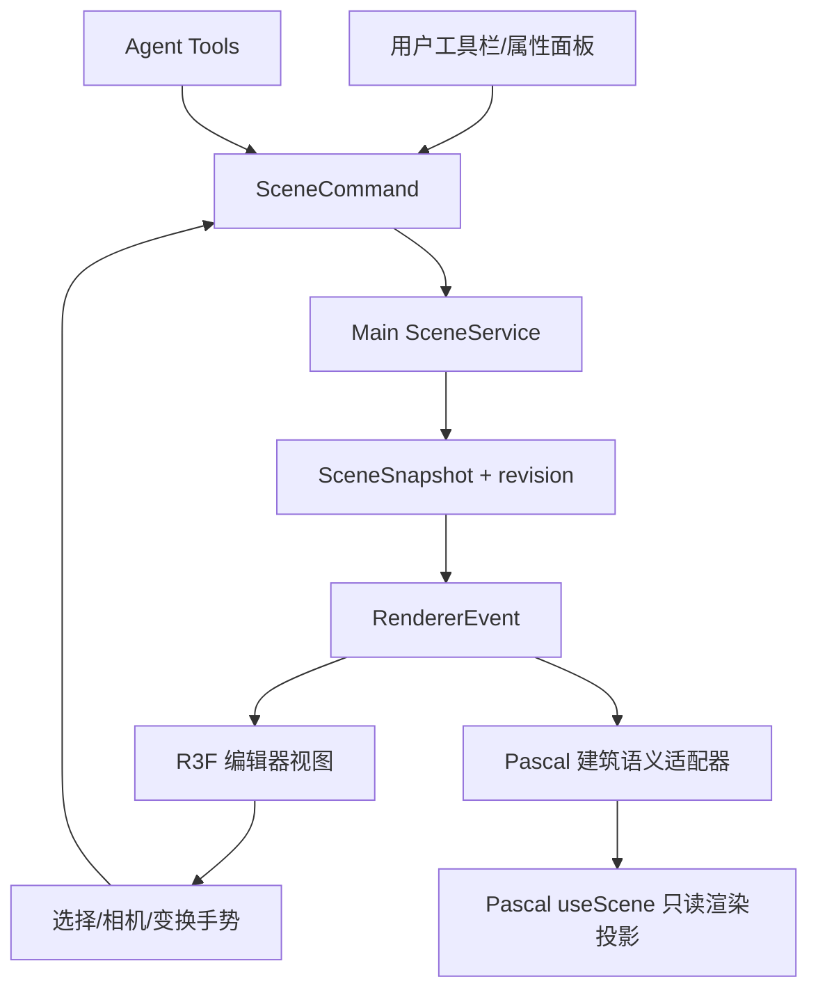

# ArchAgent 编辑器设计方案

## 1. 定位与首期范围

ArchAgent 是 Agent 驱动的建筑与空间 3D 建模工作台。首期解决从自然语言、结构化数据、户型图和参考图片创建并修改房间、楼层与建筑构件的问题。

首期重点：

1. 建筑层级：Site、Building、Level。
2. 空间构件：Wall、Slab，后续扩展 Door、Window、Zone、Ceiling、Roof。
3. 用户与 Agent 使用同一套可验证的场景命令。
4. 建筑参数、材质预设、尺寸与空间关系的可视化和编辑。
5. 导入 GLB/OBJ 作为家具、装饰或参考资产。

首期不包含顶点/边/面级 Mesh 编辑、UV、贴图烘焙、骨骼绑定、人物动画、IFC 工作流或 Blender 级通用建模。它们是后续独立能力域，不能反向决定当前建筑建模架构。

## 2. 核心决策

### 2.1 单一场景事实来源

Main 进程中的 `SceneService` 保存唯一权威 `SceneSnapshot`。Renderer、Pascal、R3F 和 Agent 都不得直接持有可提交的第二份场景状态。

所有变更必须是 `SceneCommand`：

```text
用户操作 / Agent 工具
  -> SceneCommand
  -> Main SceneService 校验与应用
  -> 新 SceneSnapshot + revision + RendererEvent
  -> 所有视图投影最新快照
```

命令失败时必须返回可读原因，不能改动 snapshot，也不能广播事件。revision、历史、项目持久化和导出均以这一链路为边界。

### 2.2 R3F 为编辑器交互壳，Pascal 为建筑语义适配器

Three.js + React Three Fiber + Drei 是统一的交互视图层，负责：

- 相机轨道、平移、缩放、视图聚焦和导航立方体。
- 选择、高亮、框选、变换 gizmo 和快捷键。
- 通用 GLB/OBJ、家具、装饰和未来任意 Mesh 的显示与变换。
- 对用户手势做命令转换，不直接修改场景数据。

`@pascal-app/core` 与 `@pascal-app/viewer` 是建筑语义渲染适配器，负责或辅助：

- 建筑层级和建筑节点的 schema/几何系统。
- 建筑构件的 WebGPU 视图、楼层可见性和后续墙体开洞能力。
- 可映射的建筑材质和选择反馈。

Pascal 不是完整编辑器 UI，也不是 SceneService 的替代品。它不承担通用 Mesh 拓扑编辑、统一 undo/redo、项目持久化或 Agent 工具入口。

### 2.3 上游参考与自研边界

`TangSY/aedifex` 是建筑编辑交互的实现参考，不是 ArchAgent 的运行时依赖。它的墙体绘制、端点移动、选择、吸附和 MCP 工具组织可用于校验我们的实现方向；但它是 Next.js 完整应用，拥有自己的 Zustand/Zundo/IndexedDB 场景状态，不能嵌入 Electron/Vite 或成为第二个场景事实来源。

ArchAgent 采用自研模块按以下顺序演进：

1. R3F 场景视口提供稳定的轨道、平移、缩放、选择和高亮。
2. 建筑工具将鼠标预览转换为 `SceneCommand`，在指针释放时才提交。
3. Pascal 只接收提交后的建筑快照，用于验证和补充建筑语义渲染。

不得复制 Aedifex 的 store、Next 路由、持久化或完整 UI；每个借鉴的交互能力必须重新连接到 ArchAgent 的 `SceneCommand -> SceneService -> SceneSnapshot` 链路。

## 3. 总体架构



### 3.1 渲染适配器契约

每个视图适配器都只消费场景快照，并声明其能力范围：

```ts
interface SceneViewportAdapter {
  render(snapshot: SceneSnapshot): void;
  focus(nodeIds: string[]): void;
  setSelection(nodeIds: string[]): void;
  readonly capabilities: ViewportCapabilities;
}
```

视图事件必须被转换为命令。例如，R3F gizmo 提交 `node.transform.update`，Pascal 中修改墙高提交 `wall.update`。视图不能直接写 Three.js `Object3D`、Pascal Zustand store 或项目文件。

### 3.2 Pascal 适配规则

统一场景契约是扁平图，使用 `parentId` 表达关系；Pascal Viewer 按 `children` 递归渲染。`PascalSceneAdapter` 必须在 Renderer 边界构建层级：

```text
SceneSnapshot.parentId
  -> Pascal children
  -> Site -> Building -> Level -> Wall / Slab / Door / Window
```

Pascal `useScene` 仅接受投影后的节点。更新 snapshot 时整体同步投影；不要把 Pascal 的本地 history、IndexedDB 持久化或本地编辑结果当作项目数据。

### 3.3 节点能力映射

| 场景能力 | Pascal | R3F 编辑器 |
| --- | --- | --- |
| Site / Building / Level / Wall / Slab | 主语义适配 | 可视化与交互 |
| Door / Window / Zone | 后续建筑适配 | 可视化与交互 |
| 材质预设与可映射 PBR 属性 | 支持适配 | 主材质编辑与预览 |
| GLB / OBJ / 家具 / 装饰 | 仅在可映射为 Item 时显示 | 主显示、选中和变换 |
| 任意 Mesh、人物、扫描模型 | 非主能力 | 主显示和后续编辑能力 |
| 顶点 / 边 / 面编辑 | 不承担 | 后续独立 Mesh 编辑域 |

当 Pascal 不支持某节点或材质特性时，R3F 必须仍能正确显示；不允许因适配失败丢失场景数据。

## 4. 场景与材质模型

```text
ProjectScene
├── ArchitectureDomain
│   └── Site -> Building -> Level -> Wall / Door / Window / Slab / Zone
└── AssetDomain
    └── MeshAsset -> GLB/OBJ、变换、材质覆盖、来源与挂载位置
```

建筑节点使用米作为坐标单位，地面为 X/Z 平面，Y 为高度。材质模型应从当前的 `materialPreset` 逐步扩展为：

```ts
type MaterialSpec = {
  preset?: string;
  color?: string;
  roughness?: number;
  metalness?: number;
  opacity?: number;
  textureAssetId?: string;
};
```

Pascal 适配器映射它能表达的字段；R3F 使用完整的 PBR 材质实现。纹理与外部模型保存为项目相对资产路径，不能在 IPC 命令中传播任意绝对文件路径。

## 5. 交互与工具

### 5.1 通用视图工具

| 工具 | 首期责任 |
| --- | --- |
| Select | 选择、取消选择、属性面板同步和高亮 |
| Orbit / Pan / Zoom | CameraControls 的轨道、平移、缩放与聚焦 |
| Move / Rotate / Scale | R3F gizmo 产生变换命令；建筑构件受领域校验约束 |
| Focus / Isolate | 根据选中节点调整视图；不修改场景 |

### 5.2 建筑创建工具

| 阶段 | 工具 | 说明 |
| --- | --- | --- |
| 当前 P0 | 墙体表单、场景树、墙体属性 | 用户和 Agent 共享 `wall.create`、`wall.update`、`node.delete` |
| P1 | WallTool、SlabTool、DoorTool、WindowTool | 鼠标预览、网格吸附、墙体端点连接和构件校验 |
| P2 | Zone、Ceiling、Roof、Item | 空间检测、参数化构件和家具资产 |

拖拽预览、gizmo 和 Ghost preview 只保存临时 UI 状态。松开鼠标或确认预览后才提交命令；取消时不产生历史记录。

## 6. Agent 集成

Agent 工具是 `SceneCommand` 的受限领域入口，不直接调用 Pascal API：

```text
用户：“在一层北侧增加 3 米砖墙”
  -> Agent 读取场景摘要
  -> create_wall 参数校验
  -> Main SceneService 应用 wall.create
  -> 广播 snapshot
  -> R3F 与 Pascal 同步更新
```

图片、户型图或外部结构化数据先生成候选命令和置信度；高影响操作使用 Ghost preview 或确认步骤。Agent 输出应包含受影响节点、revision 和失败时的校验原因。

## 7. 文件组织

```text
src/shared/modeling3d/
  sceneContracts.ts          # SceneSnapshot、节点、材质和命令契约
  sceneReducer.ts            # 纯校验与状态变更

src/main/modeling3d/
  sceneService.ts            # 唯一权威场景、IPC 事件和持久化入口

src/renderer/src/features/modeling3d/
  editor/                    # 工具栏、场景树、属性面板和临时编辑状态
  viewport/                  # R3F 相机、选择、gizmo 与通用资产视图
  scene/                     # Pascal 场景层级和数据适配器
  viewer/                    # PascalViewer 与 WebGL 降级预览
```

共享领域、Main 服务、Renderer 交互和 Pascal/R3F 适配器必须保持独立目录，禁止把命令校验、React 状态和 Three.js 几何构建堆入同一文件。

## 8. 路线图与验收

1. **P0 场景命令**：默认建筑场景、墙体新增/修改/删除、IPC、Agent 工具、场景树与属性面板。
2. **P1 空间编辑**：R3F 相机控制、选择、gizmo、画墙预览、楼板、门窗、撤销重做和项目持久化。
3. **P2 Agent 建模**：户型图/结构化数据生成、Ghost preview、材质规格、资产导入与导出。
4. **后续扩展**：通用 Mesh 编辑、人物、动画、IFC 和行业插件，各自通过新适配器接入，不修改建筑命令主链路。

首期验收标准：用户可通过表单、视图工具或 Agent 创建并修改建筑空间；每次接受的操作都在 R3F 与 Pascal 视图中反映；Pascal 不可用或不支持的资产不会阻塞 R3F 视图和场景命令。
